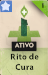
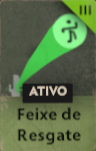
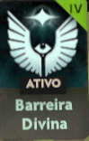
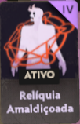
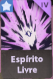

# 🌑 THE PATRON'S GRIMOIRE: SUPPORT & HEALING
### Official Field Guide | Patch 16/02/2026 | Update: "Old Gods, New Blood"

  <i>"Nós não carregamos a urna, nós garantimos que quem carrega chegue vivo."</i>

[Heroes](#-tier-list-de-suportes) • [Items](#-arsenal-obrigatório) • [Gameplan](#-estratégia-avançada)

---

## 💀 Tier List de Suportes

> **Análise do Meta:** A chegada de **Paige** e **Rem** trouxe o *"Hyper-Sustain"* para o jogo. Curas globais e invulnerabilidade estão dominando as lanes.

| Rank | Herói | Ícone | Estilo de Jogo |
| :---: | :--- | :---: | :--- |
|  | **PAIGE** |  | **Global Caster.** O escudo dela dá dano de arma. A ult atropela o mapa todo. |
|  | **REM** |  | **Pocket.** Gruda no carry, fica imortal e cura. A Yuumi do Deadlock. |
|  | **KELVIN** |  | **Objetivo.** O Domo de Gelo ganha jogos sozinho se usado na Urna ou Patron. |
|  | **IVY** |  | **Tether.** Transforma você e seu aliado em uma torreta móvel voadora. |
|  | **DYNAMO** |  | **Setup.** Só serve se o seu time tiver dano em área para combar na sua ult. |

---

## 🎒 Arsenal Obrigatório

Não importa seu boneco. Se você é suporte, **você compra isso**:

| Ícone | Nome do Item | Preço | Categoria | O que faz? |
| :---: | :--- | :---: | :---: | :--- |
|  | **Healing Rite** | `500` | 🟢 Vitality | **Early Game.** Cura forte + Sprint. Use para não voltar base na lane phase. |
|  | **Rescue Beam** | `3,000` | 🟢 Vitality | **Salva-Vidas.** Puxa o aliado para você e cura. Countera stuns e ults. |
|  | **Divine Barrier** | `3,000` | 🟢 Vitality | **Engage/Peel.** Dá escudo mágico e físico + Move Speed. Use no iniciador. |
|  | **Curse** | `6,300` | 🟣 Spirit | **Anti-Carry.** Transforma o inimigo em animal. Anula Haze, Seven e Vindicta. |
|  | **Boundless Spirit** | `10,000` | 🟣 Spirit | **Late Game.** Aumenta absurdamente o poder das suas curas e escudos. |

---

## 🧠 Estratégia Avançada

### 1. O Combo da Paige (A "Bibliotecária")
*   **Early Game:** Upe o **Skill 2 (Defend and Fight!)** primeiro. Jogue no seu parceiro de lane sempre que ele for trocar tiro. O bônus de dano ganha a troca.
*   **Team Fight:** Fique escondido. Quando a briga estourar, use a **Ult (Rallying Charge)** na direção oposta para pegar todos os inimigos pelas costas ou salvar seu time correndo.

### 2. Mecânica do Rem
*   **Dica Pro:** Você pode usar itens ativos (como *Rescue Beam* e *Curse*) enquanto está grudado (Tag Along) em alguém.
*   **Não desgrude à toa:** Se você tomar Stun enquanto pula de um aliado para outro, você morre na hora. Espere os CCs acabarem.

### 3. Quando fazer "Curse"?
Se o time inimigo tem uma **Haze** feedada ou um **Seven** ultando toda hora, o *Curse* é prioridade máxima. Esqueça itens de cura e rushe esse item.

---

  Documentação criada para a comunidade brasileira de Deadlock. 
  <i>Imagens e assets © Valve Software.</i>

