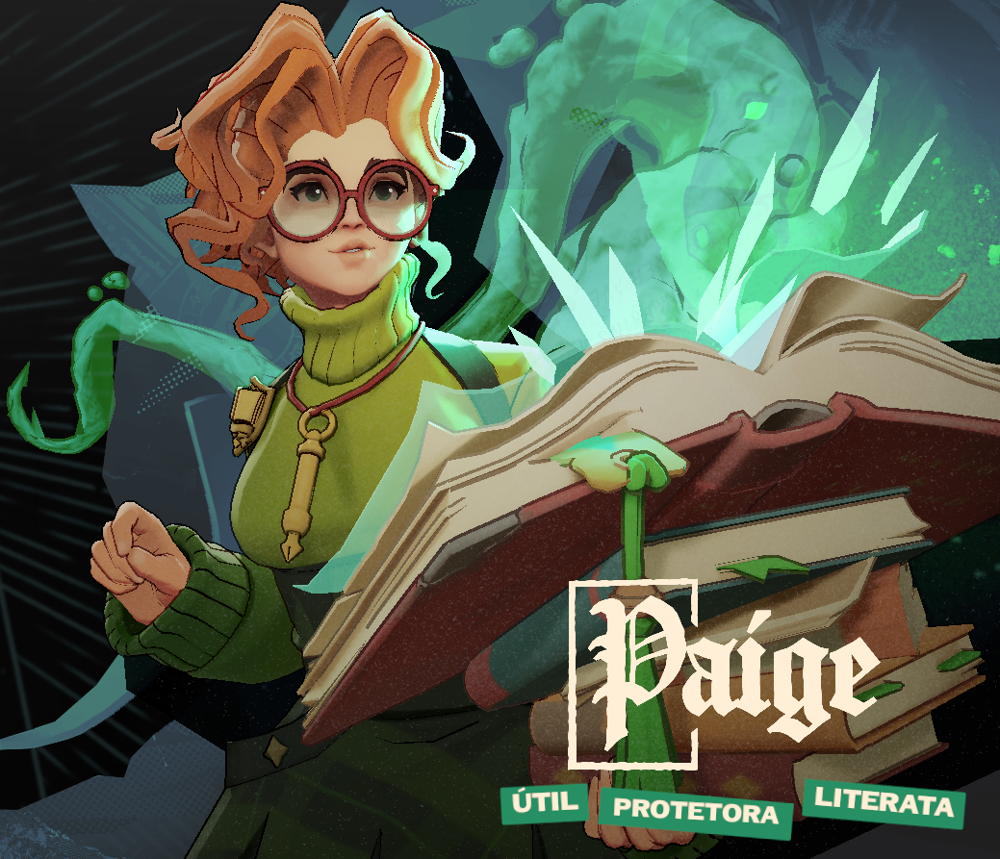
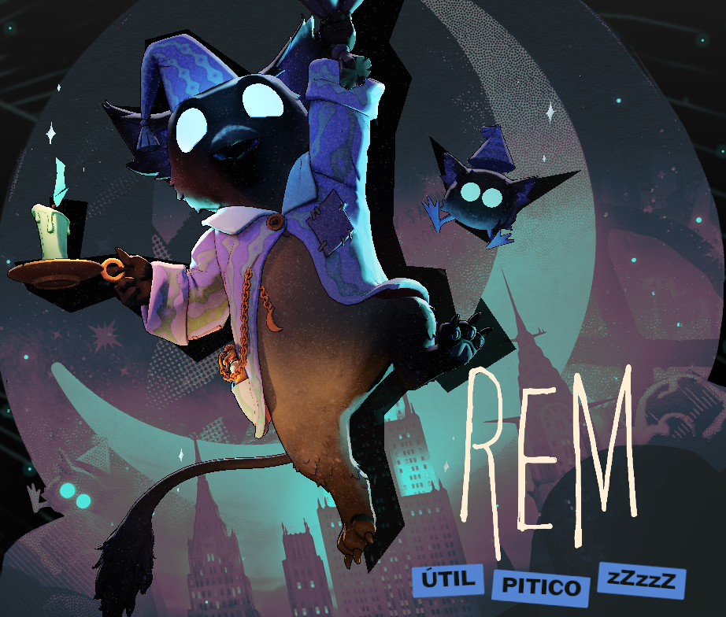
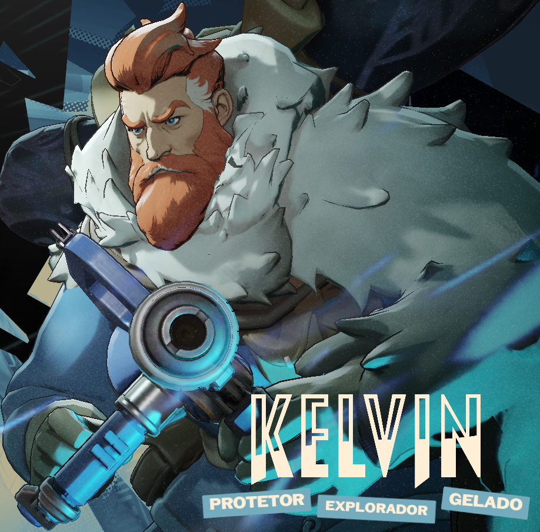
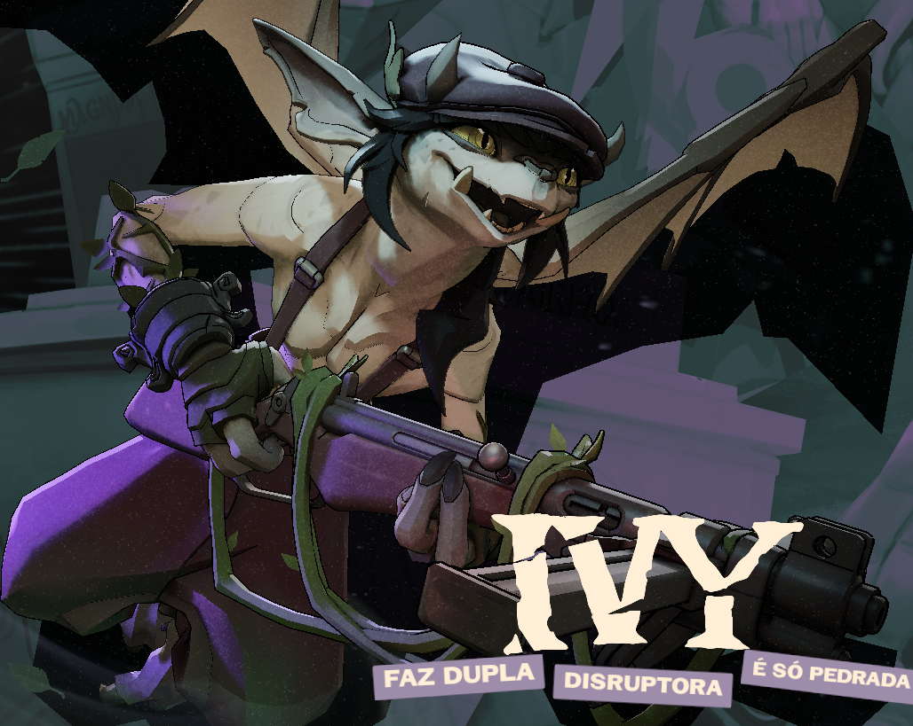
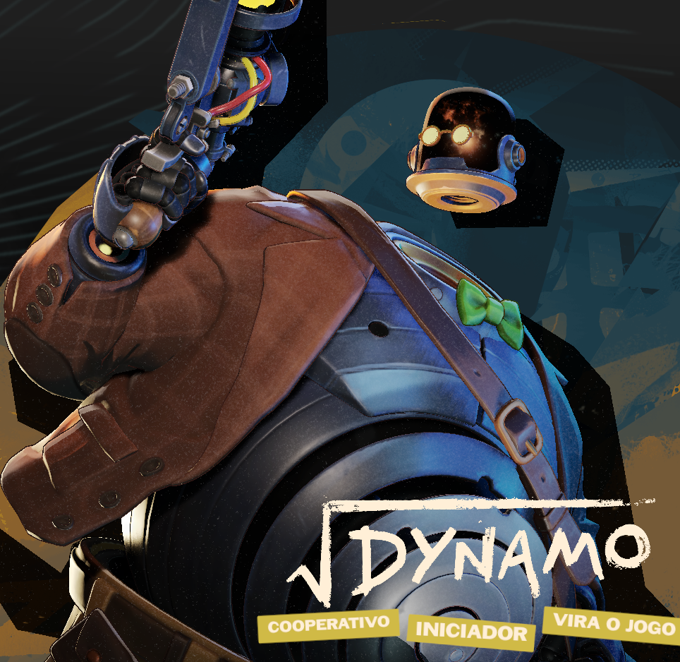

<div align="center">

# 💀 Deadlock: The Support Grimoire
### Guia de Suporte & Healers | Patch 16/02/2026 (Old Gods, New Blood)


<p align="center">
  Um guia rápido e visual para main suportes que querem dominar o meta atual.
  Baseado em dados do <a href="https://deadlock-api.com/heroes">Deadlock API</a> e <a href="https://tracklock.gg/">Tracklock</a>.
</p>

</div>

---

## 📊 Tier List Atual (Suporte)

> **Nota do Patch:** O meta atual favorece *hard sustains* e *controle de zona*. A introdução da **Paige** e do **Rem** mudou a dinâmica das lanes.

| Rank | Herói | Função Principal | Dificuldade |
| :---: | :--- | :--- | :---: |
|  | **Paige** | Escudos / Cura Global | ⭐⭐⭐ |
|  | **Rem** | Pocket Healer / Buffs | ⭐ |
|  | **Kelvin** | Cura em Área / Bloqueio | ⭐⭐ |
|  | **Ivy** | Link / Mobilidade | ⭐⭐⭐ |
|  | **Dynamo** | Setup / CC | ⭐⭐ |

---

## 🦸 Detalhes dos Heróis

### 🥇 Tier S+ (God Tier)

<table>
  <tr>
    <td width="20%" align="center">
      <br>
      <b>PAIGE</b><br>
      <i>The Librarian</i>
    </td>
    <td width="80%">
      <b>🧠 Playstyle:</b> Backline Caster. Você controla a luta de longe, punindo quem avança e salvando o time todo de uma vez.<br><br>
      <b>✨ Habilidades Chave:</b>
      <ul>
        <li><code>Skill 2</code> <b>Defend and Fight!:</b> Escudo + Dano de Arma no aliado. Use no seu Carry.</li>
        <li><code>Ult</code> <b>Rallying Charge:</b> Onda de cavaleiros global. Cura aliados e stuna inimigos no mapa todo.</li>
      </ul>
      <b>🎒 Core Items:</b> <i>Divine Barrier, Superior Cooldown, Refresher.</i>
    </td>
  </tr>
  <tr>
    <td width="20%" align="center">
      <br>
      <b>REM</b><br>
      <i>The Sleepy Demon</i>
    </td>
    <td width="80%">
      <b>🧠 Playstyle:</b> "Mochilinha". Você gruda no aliado mais forte e garante que ele não morra nunca.<br><br>
      <b>✨ Habilidades Chave:</b>
      <ul>
        <li><code>Skill 2</code> <b>Tag Along:</b> Torna-se inalvejável e "entra" no aliado, curando % de vida perdida.</li>
        <li><code>Ult</code> <b>Naptime:</b> Área enorme que coloca inimigos para dormir (Incapacitate).</li>
      </ul>
      <b>🎒 Core Items:</b> <i>Healing Nova, Boundless Spirit, Mystic Reverb.</i>
    </td>
  </tr>
</table>

### 🥈 Tier A (Strong Picks)

<details>
<summary><b>❄️ Kelvin (Clique para expandir)</b></summary>
<br>
<table>
  <tr>
    <td width="15%"></td>
    <td>
      <b>Porque escolher?</b> O melhor controle de objetivo do jogo.
      <br>Use o <b>Frozen Shelter</b> (Domo de Gelo) para fechar o Urn ou segurar o Patron. A cura dentro do domo é absurda.
    </td>
  </tr>
</table>
</details>

<details>
<summary><b>🌹 Ivy (Clique para expandir)</b></summary>
<br>
<table>
  <tr>
    <td width="15%"></td>
    <td>
      <b>Porque escolher?</b> Transforme seu carry num AC-130.
      <br>Use <b>Watcher's Covenant</b> para dividir cura e firerate. Use a ult para pegar seu aliado e voar, reposicionando ele ou salvando da morte.
    </td>
  </tr>
</table>
</details>

<details>
<summary><b>🤖 Dynamo (Clique para expandir)</b></summary>
<br>
<table>
  <tr>
    <td width="15%"></td>
    <td>
      <b>Porque escolher?</b> Wombo Combo.
      <br>Seu foco é a <b>Singularity</b> (Buraco Negro). Junte os 6 inimigos e deixe seu time explodir tudo. A cura passiva dele (Skill 2) é ótima para laning phase.
    </td>
  </tr>
</table>
</details>

---

## 🛒 Itemização Obrigatória para Suportes

Não importa o herói, se você é o Suporte, você precisa desses itens na sua build:

| Ícone | Item | Custo | Função |
| :---: | :--- | :---: | :--- |
| 🟢 | **Healing Rite** | 500 | **Early Game.** Cura forte + Sprint. Salva a lane. |
| 🟣 | **Rescue Beam** | 1250 | **Mid Game.** Puxa o aliado para você e cura. O famoso "Life Grip". |
| 🟣 | **Divine Barrier** | 1250 | Escudo instantâneo + Move Speed. Bom para engage. |
| 🟠 | **Curse** | 6300 | **Late Game.** Transforma o inimigo em sapo/porco. Countera Haze e Seven. |

---

## 💻 API & Data Fetching

Se você quiser puxar os dados mais atuais direto da API do Deadlock para automatizar este guia, aqui está um exemplo de estrutura usando a `deadlock-api`:

```javascript
// Exemplo de fetch para pegar status dos heróis
async function getSupportHeroes() {
  const response = await fetch('https://deadlock-api.com/v1/heroes');
  const heroes = await response.json();
  
  // Filtra apenas suportes/healers (baseado em tags hipotéticas)
  const supports = heroes.filter(h => 
    h.tags.includes('Support') || h.tags.includes('Healing')
  );
  
  return supports;
}
```

---

<div align="center">
  <sub>Documentação criada por um Main Suporte cansado de ver Carry morrendo.</sub><br>
  <sub><i>Deadlock e todos os assets são propriedades da Valve Software.</i></sub>
</div>
