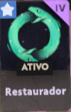

# 🌑 DEADLOCK: THE SUPPORT BIBLE
### ⚡ Patch 16/02/2026 • Update: "Old Gods, New Blood"

<!-- Texto Animado (Isso aqui dá o efeito UAU) -->

 

<!-- Badges de Status -->

 

---

## 🏆 O PANTEÃO (Tier List Visual)

<table width="100%">
  <tr>
    <td width="50%" align="center">
      <h3>👑 THE QUEEN (TIER S+)</h3>
      
        
      <h1>PAIGE</h1>
      
       
      <i>"A cura chega a cavalo."</i>
        
      <b>Por que jogar?</b> 
      Escudos que dão dano + Ult Global. 
      Se você quer carregar sem dar um tiro, é ela.
    </td>
    <td width="50%" align="center">
      <h3>😈 THE PARASITE (TIER S+)</h3>
      
        
      <h1>REM</h1>
      
       
      <i>"Não acorde o demônio."</i>
        
      <b>Por que jogar?</b> 
      Invulnerabilidade + Buff de Carry. 
      Perfeito para jogar duo com Haze ou Wraith.
    </td>
  </tr>
</table>

<table width="100%">
  <tr>
    <td align="center" width="33%">
      
      <h3>KELVIN</h3>
      
        
      ❄️ <b>Rei do Objetivo</b>
       O Domo de Gelo ganha jogos.
    </td>
    <td align="center" width="33%">
      
      <h3>IVY</h3>
      
        
      ✈️ <b>Uber Aéreo</b>
       Buff de tiro + Salva vidas voando.
    </td>
    <td align="center" width="33%">
      
      <h3>DYNAMO</h3>
      
        
      🌀 <b>Wombo Combo</b>
       Buraco Negro = Time Wipe.
    </td>
  </tr>
</table>

---

## 🎒 LOJA: O KIT DE SOBREVIVÊNCIA

Esqueça o dano. Você é suporte. Seu trabalho é manter o time vivo. **Compre isso nesta ordem:**

| Ícone | Item | Custo | Por que comprar? |
| :---: | :--- | :---: | :--- |
|  | **Healing Rite** | `500` | 🟢 **Early Game.** Dá Sprint e cura muito. Se você perder a lane com isso, a culpa é sua. |
|  | **Rescue Beam** | `3000` | 🟣 **Core Item.** Puxa o aliado. Salva de Ult do Seven, Stun do Bebop e Hook do Grey Talon. |
|  | **Divine Barrier** | `3000` | 🟢 **Engage.** Jogue no seu iniciador (Lash/Abrams) antes dele pular. Dá Move Speed. |
|  | **Curse** | `6300` | 🟣 **Late Game.** Transforma o inimigo num bicho. É o único jeito de parar uma Haze 20/0. |
|  | **Refresher** | `6300` | 🟣 **Luxo.** Reseta a Ult. Dois buracos negros? Duas ondas de cavaleiros? GG. |

---

## 🧠 DATA & STRATS (Deep Dive)

<b>🔥 Clique aqui para ver as Builds Específicas (Copy & Paste)</b>

### 🧙‍♀️ PAIGE - Build "Full Caster"
1.  **Start:** Extra Stamina, Healing Rite.
2.  **Core:** Mystic Reach, Divine Barrier, Superior Cooldown.
3.  **Luxury:** Boundless Spirit, Refresher.
4.  **Skills:** Max `2` -> Max `4` -> Max `3`.

### 😈 REM - Build "Backpack"
1.  **Start:** Spirit Strike, Extra Regen.
2.  **Core:** Healing Nova, Rescue Beam, Mystic Reverb (Slow).
3.  **Luxury:** Curse, Diviner's Kevlar.
4.  **Skills:** Max `2` -> Max `4` -> Max `1`.

---

  
  <b>Deadlock Field Guide</b> • Criado por um Main Sup cansado. 
  <i>Images © Valve Software. Data from Deadlock API.</i>

